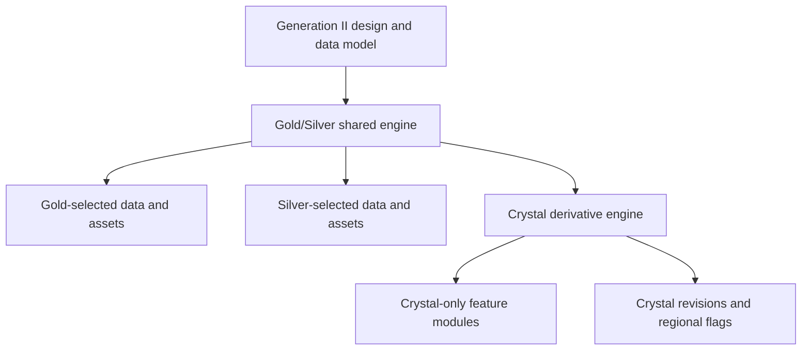
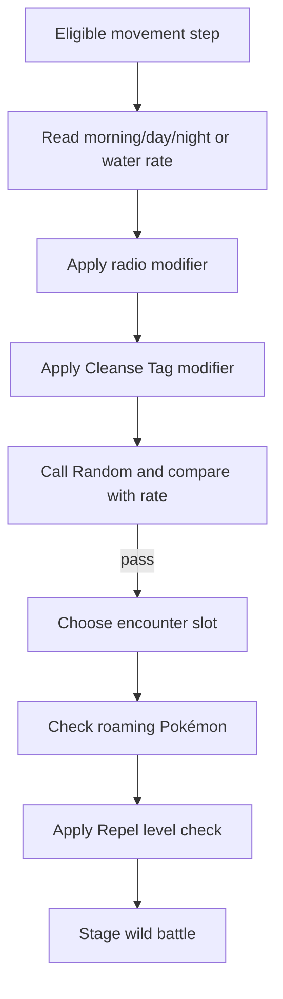
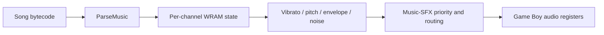
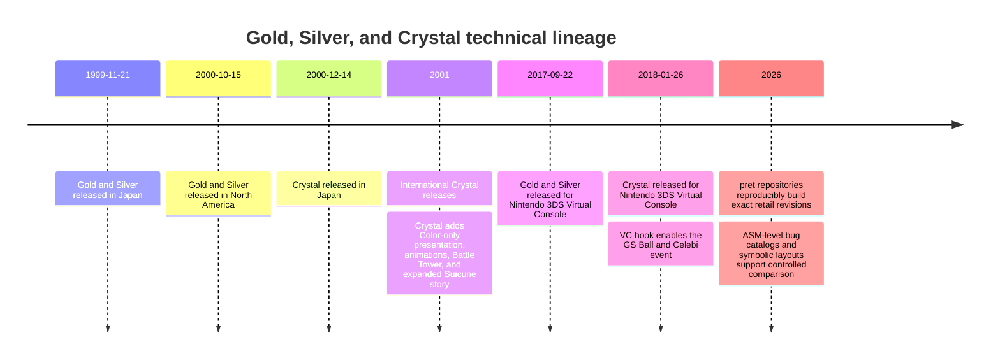

# Pokémon Gold, Silver, and Crystal: A Systematic Engine, ASM, and Behavioral Comparison

## Executive summary

Pokémon Gold and Silver are best understood as **two data-configured builds of one engine**, whereas Pokémon Crystal is an **expanded, reorganized, Color-only derivative of that engine**. The `pret/pokegold` repository reproducibly builds the international Gold and Silver ROMs byte-for-byte, while `pret/pokecrystal` separately builds multiple international Crystal revisions and debug artifacts. This makes the two repositories unusually strong primary evidence: their output hashes correspond to known retail binaries rather than merely reimplementing observed behavior.

The largest technical conclusion is that Crystal is **not a ground-up engine rewrite**. Core subsystems (the frame-driven sound interpreter, hardware-derived RNG, synchronized link-battle PRNG, wild-encounter probability machinery, party-mon record size, and much of the RTC pipeline) remain recognizably inherited from Gold/Silver. Crystal instead adds new ROM banks, reorganizes routines, introduces Color-specific rendering paths, fills formerly reserved fields in Pokémon records, redesigns SRAM placement, and layers Battle Tower, Mobile System GB, animated sprites, the female protagonist, Buena, Move Tutor, Suicune story logic, and Virtual Console hooks around the inherited core.

The most important behavioral differences are therefore caused less by wholesale algorithm replacement than by **changed control flow and data**:

| Area | Gold and Silver | Crystal | Technical consequence |
|---|---|---|---|
| Edition structure | One shared engine with edition-selected encounter, sprite, title, and other data | One enhanced-version build with regional/revision conditionals | Gold-to-Silver ports are mostly data substitutions; Gold/Silver-to-Crystal ports are architectural merges |
| Display target | Runtime distinguishes DMG/SGB/CGB modes | Explicit Color-only path | Crystal code can assume CGB palettes, VRAM banking, and related presentation behavior more aggressively |
| RNG core | Divider-register accumulator plus synchronized link PRNG | Same algorithms | Different outcomes normally arise from different call timing or paths, not a different generator |
| Party records | Two bytes after Pokérus are reserved | Those same bytes become caught-time/gender/level/location metadata | Pokémon records remain structurally compatible despite Crystal gaining metadata |
| Save layout | Main and backup data are fragmented among SRAM sections | Main and backup records become more contiguous; Crystal/Battle Tower/Mobile blocks are added | Whole `.sav` files are not drop-in interchangeable |
| Battles | Standard Gen II battle engine | Inherited engine plus Battle Tower branches and selective bug fixes | Link-compatible behavior is intentionally retained in some otherwise-fixed cases |
| Roaming Pokémon | Raikou, Entei, and Suicune use the roaming system | Only Raikou and Entei roam; Suicune becomes a scripted encounter | Encounter-state conversion requires special handling |
| Graphics | Static Pokémon fronts and DMG/SGB-compatible layouts | Animated fronts, revised sprites, richer Color layouts | Animation introduces new graphics data, decompression, frame, and timing requirements |
| Audio | Shared four-channel Game Boy music interpreter | Same interpreter plus new songs and call sites | Music ports are mostly data/pointer work rather than synthesizer rewrites |
| Major fixed defects | Coin Case arbitrary code execution, first-save Hall of Fame corruption, Lucky Number box limit, and several map/text defects | Corrected | Crystal is safer, but not "bug-fixed Gen II" in the broad sense |
| Persistent defects | Many Gen II battle, capture, item, and badge defects | Many remain | Mechanical compatibility often outweighed cleanup |

Gold and Silver themselves have almost no meaningful engine-level divergence. Their scientifically interesting comparison is principally **which tables and assets are selected at assembly time**. Crystal is the meaningful engine comparison.

The report assumes a technically literate audience familiar with low-level programming but not necessarily Game Boy internals. Unless explicitly stated, "Crystal" means the international English code represented by `pret/pokecrystal`; Japanese Mobile System GB and Australian/revision-specific behavior are treated as regional variants. "Scientific" here means reproducible binary-derived comparison, explicit source hierarchy, and separation of direct evidence from inference, not laboratory experimentation involving original development source code, which has not been publicly released.

## Scope, evidence, and reproducibility

### Source hierarchy

The strongest sources are the two pret disassemblies:

- [`pret/pokegold`](https://github.com/pret/pokegold), which builds exact Gold and Silver international ROM images.
- [`pret/pokecrystal`](https://github.com/pret/pokecrystal), which builds Crystal international v1.0, v1.1, Australian, and debug images.

The repositories identify exact SHA-1 outputs. Gold builds to `d8b8a3600a465308c9953dfa04f0081c05bdcb94`, Silver to `49b163f7e57702bc939d642a18f591de55d92dae`, Crystal international v1.0 to `f4cd194bdee0d04ca4eac29e09b8e4e9d818c133`, and Crystal international v1.1 to `f2f52230b536214ef7c9924f483392993e226cfb`. Those reproducible identities are critical: a label such as `BadgeStatBoosts` is a reverse-engineered name, but the emitted bytes and resulting behavior are those of the retail ROM.

Secondary sources such as Bulbapedia and Serebii are useful for player-visible cross-checking, release differences, encounter availability, and historical context. The pret bug documents are stronger than ordinary wiki summaries for defects because they identify the responsible instructions and provide corrective diffs. Official Nintendo and Pokémon sources are most valuable for release/Virtual Console behavior and supported transfer paths, but they do not publish the games' assembly architecture.

### Reproducible comparison method

A rigorous comparison should operate at four levels:

| Level | Method | What it establishes | Main limitation |
|---|---|---|---|
| Binary identity | Build each repository with its pinned RGBDS-compatible toolchain and verify SHA-1 | The source corresponds to the target retail ROM | Does not explain why bytes differ |
| Source topology | Compare `main.asm`, `home.asm`, bank sections, include graphs, WRAM/SRAM declarations | Architectural additions, removals, and relocation | File organization can change without behavioral change |
| Routine semantics | Compare labels, branches, register use, calls, data offsets, and side effects | Control-flow and algorithmic differences | Labels and comments are community-derived |
| Behavioral validation | Run controlled emulator tests with trace logging and fixed input timing | Observable consequences and RNG/cycle sensitivity | Emulator accuracy and RTC state must be controlled |

For a formal experiment, the recommended independent variables are edition, ROM revision, initial SRAM, RTC register state, boot hardware mode, input sequence, and link mode. Dependent variables include RNG bytes, encounter choice, battle result, SRAM writes, audio commands, VRAM/OAM writes, and cycle/frame number. Because the ordinary RNG reads the divider register, deterministic comparisons must start from a controlled boot state and reproduce input timing at frame or cycle precision.

### Gold versus Silver as a build-configuration comparison

The fact that `pokegold` emits both Gold and Silver from one repository is itself strong evidence that the two versions share the same broad code architecture. Edition differences are implemented through conditional assembly and alternate data or assets rather than through separate engines. The obvious behavioral results are version-specific wild Pokémon, title graphics, mascot-facing presentation, and selected NPC or table data; battle arithmetic, saves, RTC processing, audio interpretation, and link handling come from the same shared source.

This distinction matters for analysis. Treating Gold, Silver, and Crystal as three equally separate engines exaggerates Gold/Silver differences and understates Crystal's structural changes. A better model is:



## ROM and engine architecture

### Banked execution model

The games execute on the Game Boy's LR35902-class CPU and are organized around a fixed home bank plus switchable ROM banks. Calls across banks generally pass through wrappers that save the current bank, select the target bank, call the routine, and restore the original bank. The `BattleRandom` wrapper is a concise example: `_BattleRandom` resides outside the home bank, so the wrapper saves `hROMBank`, uses the bank-switch restart vector, calls the routine, preserves its return value, and restores the previous bank.

```asm
BattleRandom::
    ldh a, [hROMBank]
    push af
    ld a, BANK(_BattleRandom)
    rst Bankswitch
    call _BattleRandom
    ...
    pop af
    rst Bankswitch
    ret
```

Relevant sources: [Gold/Silver `home/random.asm`](https://github.com/pret/pokegold/blob/a0dad0957ac8a9ffa67e950ee3ab6715a212ded5/home/random.asm#L29-L46) and [Crystal `home/random.asm`](https://github.com/pret/pokecrystal/blob/8e8f7e20052a596371a77022f0392c285e51bbf1/home/random.asm#L29-L46).

The repositories' top-level `main.asm` files are effectively link manifests for this architecture. Gold/Silver's file groups the battle core, encounters, party menu, RTC, phone, Pokégear, sprite animation, graphics loading, and other systems into named ROM sections. Crystal retains those categories but adds explicitly named feature sections and many additional modules.

### Crystal as an extension and bank-layout rewrite

Crystal's `main.asm` introduces a conspicuous `Crystal Features 1` section containing gender initialization, Kris-specific bag handling, Move Tutor, Crystal layouts, Celebi logic, the redesigned main menu, Mobile menu code, owned-Pokémon search, and Buena's menu. Nearby banks add Battle Tower trainer logic, caught-data handling, a revised stats screen, sliding battle intros, battle-scene checks, and the Color-only startup screen.

That include topology supports three conclusions.

First, Crystal preserves **vertical subsystem continuity**. The battle engine is still `engine/battle/core.asm`; encounters remain `engine/overworld/wildmons.asm`; Pokémon records still derive from the same party/box macros; and audio is still driven by the same interpreter.

Second, Crystal adds **horizontal feature coupling**. Battle Tower touches battle setup, stat boosts, experience rules, saving, menus, SRAM, trainers, music, and link-like constraints. The female protagonist touches initialization, sprites, bag graphics, caught metadata, and menu presentation. Mobile support touches interrupts, SRAM, menus, communications, rankings, and audio.

Third, code and data relocation is substantial enough that raw ROM addresses from Gold/Silver cannot generally be transplanted into Crystal. A symbolic port based on labels and structures is practical; a patch based on absolute offsets is brittle.

### File and routine comparison

| Subsystem | Gold/Silver source | Crystal source | ASM-level difference | Porting significance |
|---|---|---|---|---|
| Top-level bank graph | [`main.asm`](https://github.com/pret/pokegold/blob/a0dad0957ac8a9ffa67e950ee3ab6715a212ded5/main.asm) | [`main.asm`](https://github.com/pret/pokecrystal/blob/8e8f7e20052a596371a77022f0392c285e51bbf1/main.asm) | Crystal adds feature, Battle Tower, Mobile, gender, animation, and caught-data modules and relocates shared includes | Port by symbol and feature dependency, not ROM offset |
| Ordinary RNG | [`home/random.asm`](https://github.com/pret/pokegold/blob/a0dad0957ac8a9ffa67e950ee3ab6715a212ded5/home/random.asm) | [`home/random.asm`](https://github.com/pret/pokecrystal/blob/8e8f7e20052a596371a77022f0392c285e51bbf1/home/random.asm) | Essentially identical routine and rejection-sampling helper | RNG-sensitive ports must preserve call timing |
| Battle core | [`engine/battle/core.asm`](https://github.com/pret/pokegold/blob/a0dad0957ac8a9ffa67e950ee3ab6715a212ded5/engine/battle/core.asm) | [`engine/battle/core.asm`](https://github.com/pret/pokecrystal/blob/8e8f7e20052a596371a77022f0392c285e51bbf1/engine/battle/core.asm) | Crystal adds Battle Tower guards and conditional fixes while retaining link behavior | Mechanical changes can desynchronize unmodified peers |
| Encounters | [`engine/overworld/wildmons.asm`](https://github.com/pret/pokegold/blob/a0dad0957ac8a9ffa67e950ee3ab6715a212ded5/engine/overworld/wildmons.asm) | [`engine/overworld/wildmons.asm`](https://github.com/pret/pokecrystal/blob/8e8f7e20052a596371a77022f0392c285e51bbf1/engine/overworld/wildmons.asm) | Same rate/slot pipeline; different swarm state and two rather than three roamers | World-state conversion needs special Suicune handling |
| SRAM declaration | [`ram/sram.asm`](https://github.com/pret/pokegold/blob/a0dad0957ac8a9ffa67e950ee3ab6715a212ded5/ram/sram.asm) | [`ram/sram.asm`](https://github.com/pret/pokecrystal/blob/8e8f7e20052a596371a77022f0392c285e51bbf1/ram/sram.asm) | Crystal consolidates save/backup regions and adds GS Ball, Battle Tower, rankings, and Mobile blocks | Whole-save binary compatibility is lost |
| Pokémon structures | [`pokemon_data_constants.asm`](https://github.com/pret/pokegold/blob/a0dad0957ac8a9ffa67e950ee3ab6715a212ded5/constants/pokemon_data_constants.asm#L69-L103) | [`pokemon_data_constants.asm`](https://github.com/pret/pokecrystal/blob/8e8f7e20052a596371a77022f0392c285e51bbf1/constants/pokemon_data_constants.asm#L69-L108) | Crystal assigns caught metadata to two bytes reserved in Gold/Silver | Record length remains compatible |
| RTC/home time | [`home/time.asm`](https://github.com/pret/pokegold/blob/a0dad0957ac8a9ffa67e950ee3ab6715a212ded5/home/time.asm) | [`home/time.asm`](https://github.com/pret/pokecrystal/blob/8e8f7e20052a596371a77022f0392c285e51bbf1/home/time.asm) | Same RTC model; Crystal timer interrupt can dispatch Mobile timing | Emulator ports must emulate RTC and, for Japanese features, mobile timing assumptions |
| Picture loading | [`engine/gfx/load_pics.asm`](https://github.com/pret/pokegold/blob/a0dad0957ac8a9ffa67e950ee3ab6715a212ded5/engine/gfx/load_pics.asm) | [`engine/gfx/load_pics.asm`](https://github.com/pret/pokecrystal/blob/8e8f7e20052a596371a77022f0392c285e51bbf1/engine/gfx/load_pics.asm) | Crystal has additional front-picture and animation-oriented handling | Static sprite replacement is insufficient |
| Sound interpreter | [`audio/engine.asm`](https://github.com/pret/pokegold/blob/a0dad0957ac8a9ffa67e950ee3ab6715a212ded5/audio/engine.asm) | [`audio/engine.asm`](https://github.com/pret/pokecrystal/blob/8e8f7e20052a596371a77022f0392c285e51bbf1/audio/engine.asm) | Core interpreter is structurally the same | New Crystal music is primarily sequenced data and pointers |
| Song table | [`audio/music_pointers.asm`](https://github.com/pret/pokegold/blob/a0dad0957ac8a9ffa67e950ee3ab6715a212ded5/audio/music_pointers.asm) | [`audio/music_pointers.asm`](https://github.com/pret/pokecrystal/blob/8e8f7e20052a596371a77022f0392c285e51bbf1/audio/music_pointers.asm#L97-L108) | Crystal appends ten named songs | Existing song IDs remain stable through the Gold/Silver range |

The line counts of several Crystal files are larger, but line count alone is not a behavioral metric; comments, label quality, and source refactoring affect it. The stronger evidence is the presence of new branches, fields, tables, and externally observable side effects.

### Hardware-mode divergence

Gold/Silver initialization tests whether the console is a Game Boy Color and maintains non-CGB paths, including Super Game Boy initialization. Crystal includes an explicit `gbc_only.asm` module that displays the incompatibility message on non-CGB hardware. That is not merely marketing metadata: it changes what assumptions later rendering code may safely make about palettes, VRAM banking, and Color hardware.

For a reverse port of Crystal features into Gold/Silver, every CGB-only feature falls into one of three categories: provide a monochrome/SGB fallback, disable it outside CGB mode, or intentionally convert the resulting ROM into a Color-only build. Skipping that decision produces subtle failures rather than one clean compile error: palette attributes, second-bank VRAM data, and tile-upload timing can all be implicated.

## Save, RNG, clock, and entity state

### Save architecture

Gold/Silver divide their main game state into options, three player-data fragments, current-map data, Pokémon data, and a checksum. Backup pieces are distributed among several separately placed SRAM sections. The current PC box is separate, the fourteen inactive boxes occupy exactly two SRAM banks, and mail and Mystery Gift have dedicated regions.

Crystal instead defines a contiguous `sGameData` consisting of player, map, and Pokémon data, pads the region, and stores a checksum. Its backup is similarly grouped. Crystal then adds a GS Ball flag, `sCrystalData`, Battle Tower progress and recent-trainer state, ranking records, Mobile communication data, offers, credentials, and Japanese Mobile-specific buffers. The source explicitly notes that the international `sCrystalData` location differs from Japanese Crystal.

| Save component | Gold/Silver | Crystal |
|---|---|---|
| Options and corruption sentinels | Present | Present |
| Main player/map/Pokémon data | Split into labeled player fragments inside the save region | Grouped into one contiguous main-game block |
| Main checksum | 16-bit checksum after game data | 16-bit checksum after padded game-data region |
| Backup | Fragmented among multiple SRAM sections | Consolidated backup game-data block |
| Current box | Separate `curbox` structure | Separate full `box` structure plus padding |
| Inactive boxes | Fourteen boxes over two SRAM banks | Same fourteen-box capacity over two banks |
| Party and mailbox mail | Dedicated primary and backup regions | Same broad model |
| GS Ball state | Absent | Primary and backup flags |
| Battle Tower | Absent | Challenge state, streak, previous teams, reward |
| Mobile/rankings | Absent | Several additional SRAM sections |
| Full-file compatibility | Gold and Silver are closely related but still edition-specific | Not layout-compatible with Gold/Silver |

Crystal's save routine makes the transactional sequence visible:

```asm
_SaveGameData:
    farcall StageRTCTimeForSave
    farcall BackupMysteryGift
    call ValidateSave
    call SaveOptions
    call SavePlayerData
    call SavePokemonData
    call SaveBox
    call SaveChecksum
    call ValidateBackupSave
    ...
    farcall BackupGSBallFlag
    farcall SaveRTC
```

Source: [Crystal `engine/menus/save.asm`](https://github.com/pret/pokecrystal/blob/8e8f7e20052a596371a77022f0392c285e51bbf1/engine/menus/save.asm#L255-L284). The routine stages RTC state, writes the primary data and box, computes the primary checksum, writes backup data and checksum, backs up party mail and GS Ball state, persists RTC state, and normalizes a completed Battle Tower reward state.

The practical conclusion is precise: **do not migrate a Gold/Silver `.sav` to Crystal by copying the file or the main save block**. A converter should parse symbolic fields, validate checksums and sentinels, copy player/map/Pokémon/box/mail data field by field, initialize Crystal-only state, and regenerate Crystal checksums. Gold-to-Silver conversion is less structurally disruptive, but version-dependent event and encounter state should still be treated deliberately.

### Party and boxed-Pokémon records

One of Crystal's most elegant compatibility decisions is visible at the structure-definition level. In Gold/Silver, the two bytes after `MON_POKERUS` are simply reserved:

```asm
DEF MON_HAPPINESS rb
DEF MON_POKERUS   rb
                  rb_skip 2
DEF MON_LEVEL     rb
```

In Crystal, the same positions are assigned to a two-byte caught-data field:

```asm
DEF MON_HAPPINESS  rb
DEF MON_POKERUS    rb
DEF MON_CAUGHTDATA rw
DEF MON_LEVEL      rb
```

Sources: [Gold/Silver structure](https://github.com/pret/pokegold/blob/a0dad0957ac8a9ffa67e950ee3ab6715a212ded5/constants/pokemon_data_constants.asm#L83-L101) and [Crystal structure](https://github.com/pret/pokecrystal/blob/8e8f7e20052a596371a77022f0392c285e51bbf1/constants/pokemon_data_constants.asm#L83-L107).

Crystal packs caught time and trainer gender into one byte and caught level and location into another. Because Game Freak repurposed reserved bytes instead of extending the record, `BOXMON_STRUCT_LENGTH` and `PARTYMON_STRUCT_LENGTH` remain compatible. Gold/Silver can carry those bytes without understanding them; Crystal can interpret them when present. This is a major reason Gen II Pokémon can move among Gold, Silver, and Crystal without a record-size translation layer.

A second structure change appears in the base-species TM/HM compatibility bitset. Gold/Silver size it for `NUM_TM_HM`; Crystal sizes it for `NUM_TM_HM_TUTOR`, accommodating Move Tutor compatibility in the same species-data model. This means a straight copy of Gold/Silver base-stat records into Crystal must account for Crystal's expanded learnability domain even if the visible species stats are unchanged.

### Item and party handling

The basic inventory model (separate item pockets, held-item byte in each Pokémon record, party length of six, PC boxes, mail records, and item-dispatch routines) is inherited. Crystal's changes are concentrated in new consumers and UI behavior: Move Tutor eligibility, gender-specific player presentation, caught metadata, Battle Tower restrictions, and additional event items such as GS Ball state.

Crystal did **not** comprehensively repair the item mechanics. Its documented defects still include Moon Ball not applying its intended multiplier, Love Ball checking the wrong gender relationship, Fast Ball applying to only a few species, three incorrect Heavy Ball weight cases, and status conditions failing to affect capture rate as intended. Those defects live in shared mechanical paths and are important when evaluating a "faithful" engine port: correcting them changes gameplay and may alter deterministic test vectors.

### Ordinary RNG

Gold/Silver and Crystal use the same ordinary RNG routine. It samples the hardware divider register and updates two one-byte accumulators, one by addition-with-carry and one by subtraction-with-carry:

```asm
ldh a, [rDIV]
ld b, a
ldh a, [hRandomAdd]
adc b
ldh [hRandomAdd], a

ldh a, [rDIV]
ld b, a
ldh a, [hRandomSub]
sbc b
ldh [hRandomSub], a
```

Sources: [Gold/Silver](https://github.com/pret/pokegold/blob/a0dad0957ac8a9ffa67e950ee3ab6715a212ded5/home/random.asm#L13-L27) and [Crystal](https://github.com/pret/pokecrystal/blob/8e8f7e20052a596371a77022f0392c285e51bbf1/home/random.asm#L13-L27). The files are effectively identical, including the `RandomRange` rejection-sampling routine used to avoid simple modulo bias.

This generator is not a self-contained seeded PRNG in the modern sense. Its output depends on divider phase, previous accumulator state, carry state, VBlank updates, and when the routine is reached. Consequently, adding an animation, menu delay, conditional call, or extra random-consuming feature can alter later outcomes even while the RNG instructions remain unchanged.

### Link-battle PRNG

Battles route randomness through `BattleRandom`. In non-link play, `_BattleRandom` ultimately uses the ordinary RNG. In linked battles, both systems consume a shared ten-byte random sequence and advance bytes with the recurrence:

```
x[n+1] = (5 * x[n] + 1) mod 256
```

The Gold/Silver and Crystal battle cores contain the same broad synchronization mechanism.

This has a major compatibility consequence: a battle patch can be logically correct in isolation yet break link play if it causes one participant to make a different number or order of RNG calls. That is why Crystal sometimes preserves Gold/Silver behavior specifically in link battles. Synchronization depends on matching control flow, not merely using the same random-number formula.

### RTC and time-of-day behavior

Both codebases latch the MBC3-style real-time clock, read seconds, minutes, hours, and the low/high day registers, normalize time, add the player's selected starting offset, and derive the current time-of-day state. Crystal's `UpdateTime` remains a short chain of `GetClock`, `FixDays`, `FixTime`, and `GetTimeOfDay`.

Crystal's source shows the day counter reduced modulo 140 for the game's weekly/event model, with status flags distinguishing an RTC count beyond 139 days and a hardware day-high overflow beyond 255 days. The displayed game time is formed by adding the new-game start offsets to RTC values with carry through seconds, minutes, hours, and day.

The notable architectural addition is the Crystal timer interrupt's Mobile dispatch:

```asm
Timer::
    push af
    ldh a, [hMobile]
    and a
    jr z, .not_mobile
    call MobileTimer
.not_mobile
    pop af
    reti
```

Source: [Crystal `home/time.asm`](https://github.com/pret/pokecrystal/blob/8e8f7e20052a596371a77022f0392c285e51bbf1/home/time.asm#L2-L11). The ordinary RTC logic remains inherited; Japanese/mobile Crystal adds another timing consumer.

For emulators, flash cartridges, and ports, SRAM alone is insufficient. RTC registers, halt/carry state, elapsed host time, and game offsets must be preserved consistently. A save imported without corresponding RTC state may be structurally valid yet produce incorrect daily events, phone behavior, berries, swarms, day-of-week encounters, or time-dependent evolutions.

## Battles and encounters

### Battle-engine inheritance

The core Gen II battle model is shared: turn selection, speed ordering, accuracy, damage, stat stages, held items, status, volatile effects, experience, capture, AI, and link synchronization follow the same broad engine. Crystal's battle core is larger principally because it adds Battle Tower integration, additional presentation paths, and selective corrections.

Crystal is therefore mechanically closer to a patched and extended Gold/Silver than to a later-generation ruleset. There are no abilities, natures, modern physical/special move split, or rewritten damage model. Its new content operates within Gen II's existing move and Pokémon structures.

### Control-flow difference: Battle Tower exclusions

Gold/Silver's `BadgeStatBoosts` exits for link battles and otherwise applies badge boosts. Crystal adds a second early return when `wInBattleTowerBattle` is nonzero:

```asm
ld a, [wLinkMode]
and a
ret nz

ld a, [wInBattleTowerBattle]
and a
ret nz
```

Source: [Crystal `BadgeStatBoosts`](https://github.com/pret/pokecrystal/blob/8e8f7e20052a596371a77022f0392c285e51bbf1/engine/battle/core.asm#L6526-L6532). Gold/Silver have only the link-mode guard at the corresponding point.

This tiny six-instruction addition is representative of Crystal's design. The stat algorithm was not replaced; Crystal introduced a new battle context and inserted a guard so adventure-only badge advantages do not leak into the standardized Battle Tower. Similar context checks appear around experience and other post-battle handling.

### Selective fixes constrained by link compatibility

The pret Crystal bug documentation explicitly states that Crystal fixed Gold/Silver's Reflect/Light Screen overflow and Present damage behavior only where doing so would not break ordinary cross-version link battles. Link-mode behavior retains the compatible path.

That is an important historical engineering tradeoff. A fully corrected Crystal battle engine would disagree with Gold/Silver on intermediate values and potentially on RNG consumption, damage, fainting, or message sequence. Compatibility with the installed base was treated as a protocol requirement. Consequently, "Crystal fixed the bug" can mean **fixed in single-player but deliberately retained in linked simulation**.

### Shared and persistent battle defects

Crystal retains a substantial Gen II defect surface. Documented examples include:

| Defect | Mechanical effect | Crystal status |
|---|---|---|
| "100%" secondary effects | Fail in 1/256 qualifying cases | Retained |
| Belly Drum | May maximize Attack even when the HP requirement is not properly met | Retained |
| Berserk Gene | Confusion duration can become 256 turns or inherit stale state | Retained |
| Confusion damage | Can receive type-item and Explosion/Self-Destruct modifiers | Retained |
| Beat Up | Can behave incorrectly and can desynchronize link battles | Retained |
| Return/Frustration edge | Can produce zero damage at extreme happiness values | Retained |
| Dragon boosting item | Dragon Scale is checked instead of Dragon Fang | Retained |
| Glacier Badge | Special Defense boost depends incorrectly on overwritten accumulator state | Retained |
| Capture status bonus | Burn, poison, and paralysis do not contribute as intended | Retained |
| Specialty Balls | Multiple Apricorn-ball formulas target the wrong condition or table | Retained |

These are documented against original Crystal code, not inferred from modern competitive summaries.

The Glacier Badge defect is especially instructive at ASM level. The routine shifts a badge bitfield through register `b`, calls `BoostStat`, and later reuses register `a` as if it still contained the expected badge value. `BoostStat` can overwrite `a`, so whether Special Defense receives its boost depends on the Special Attack calculation's resulting register state. The bug survived Crystal even though the source gained an explicit comment identifying it.

### Gold/Silver defects corrected in Crystal

The `pokegold` bug document separates defects fixed in Crystal from defects still shared with it. It identifies seven clear Gold/Silver corrections: Coin Case arbitrary code execution, Hall of Fame corruption when no prior save exists, Lucky Number failure to inspect boxes 10-14, Present text overflow, surfing onto NPCs, fishing inside Cerulean Gym, and Route 15 capitalization.

The Coin Case correction is one bytecode-level terminator change:

```diff
 text "Coins:"
 line "@"
 text_decimal wCoins, 2, 4
-done
+text_end
```

Source: [`pokegold/docs/bugs_and_glitches.md`](https://github.com/pret/pokegold/blob/a0dad0957ac8a9ffa67e950ee3ab6715a212ded5/docs/bugs_and_glitches.md#L20-L34). The Gold/Silver terminator permits text-command execution to continue into unintended memory under exploitable conditions; Crystal ends the text stream correctly.

The Hall of Fame correction adds a saved-at-least-once check and erases/initializes previous-save structures before attempting the Hall of Fame write. The Lucky Number correction changes the loop bound from the Japanese box count constant to the international fourteen-box count. Both are good examples of Crystal correcting localization-sensitive state assumptions rather than changing game design.

### Encounter-rate algorithm

Gold/Silver and Crystal use essentially the same high-level encounter pipeline:



In both engines, `TryWildEncounter` gets the map rate, applies Pokémon March/Ruins of Alph doubling or Pokémon Lullaby halving, applies Cleanse Tag halving, draws an RNG byte, chooses a slot from grass or water probability tables, and checks Repel.

Grass records contain separate morning, day, and night slot blocks; the active block is selected through `wTimeOfDay`. Water uses a separate rate and three-slot table. The structure constants remain seven grass slots and three water slots in both codebases.

### Encounter-table differences

Gold and Silver primarily diverge through edition-conditioned tables. Crystal has its own consolidated tables and changes both availability and placement. It makes several former Gold/Silver exclusives obtainable in one edition, while removing some species available in both base versions; Mareep's evolutionary family is a prominent Crystal omission. Crystal also moves species such as Sneasel to different locations.

The engine/table distinction is important. An encounter may differ because:

1. the map's encounter-rate byte changed;
2. a morning/day/night slot changed;
3. the slot's level changed;
4. a swarm override changed;
5. a roaming Pokémon was removed from the roaming subsystem;
6. the map itself gained or lost encounter-enabled tiles.

A robust diff should therefore compare map headers, wild tables, swarm flags, and roaming initialization, not merely produce a Pokédex availability list.

### Swarms and roaming state

Gold/Silver's swarm lookup is comparatively generic: it compares the current map against `wSwarmMapGroup` and `wSwarmMapNumber`. Crystal's code has explicit Dunsparce and Yanma swarm flags and corresponding map state. That is a data-model specialization, not just a changed encounter table.

The roaming difference is even clearer. Gold/Silver initialize three records:

```asm
ld a, RAIKOU
ld [wRoamMon1Species], a
ld a, ENTEI
ld [wRoamMon2Species], a
ld a, SUICUNE
ld [wRoamMon3Species], a
```

Crystal initializes only Raikou and Entei:

```asm
ld a, RAIKOU
ld [wRoamMon1Species], a
ld a, ENTEI
ld [wRoamMon2Species], a
```

Sources: [Gold/Silver `InitRoamMons`](https://github.com/pret/pokegold/blob/a0dad0957ac8a9ffa67e950ee3ab6715a212ded5/engine/overworld/wildmons.asm#L471-L511) and [Crystal `InitRoamMons`](https://github.com/pret/pokecrystal/blob/8e8f7e20052a596371a77022f0392c285e51bbf1/engine/overworld/wildmons.asm#L476-L506).

Gold/Silver's subsequent selection logic describes an equal choice among three beasts after the roaming check succeeds; Crystal changes the corresponding comment and index range to two. Suicune's removal is tied to Crystal's expanded Eusine/Suicune plot and scripted Tin Tower encounter.

For save conversion, a Gold/Silver Suicune roaming record cannot simply remain active in Crystal. The converter must map capture/defeat/event state into Crystal's scripted Suicune flags or deliberately define a hybrid behavior.

## Graphics and audio

### Tile, palette, and sprite model

All three games retain the Game Boy's tile-oriented rendering model: graphics are stored as compact tile data, decompressed or copied into VRAM, arranged through background/window tilemaps, and supplemented by hardware sprites through shadow OAM. Pokémon and many UI images use four-color source palettes, with separate palette data determining their actual colors. The pokecrystal FAQ explicitly notes the four-color paletted-PNG convention and the distinction between image data and palette data.

Gold/Silver must support original Game Boy-style output and Super Game Boy behavior as well as Game Boy Color enhancements. Crystal's explicit Color-only startup path lets it make stronger use of CGB layout and palette machinery. Its top-level architecture adds `crystal_layouts.asm`, dedicated player graphics, revised map and battle presentation, and other CGB-focused modules.

### Animated Pokémon sprites

Crystal's headline renderer change is animated front sprites. Every Pokémon receives an entrance animation, and the status/profile viewer can play a longer animation; several designs, palettes, and back sprites were also revised. Crystal additionally gives the legendary beasts distinct overworld sprites and introduces richer trade-screen presentation.

At the engine level, this requires more than storing extra frames. A full animation path needs:

- a base front picture and additional frame or bitmask data;
- frame sequencing and duration state;
- tile-buffer reconstruction or differential tile updates;
- synchronization with battle intro control flow;
- palette and VRAM updates during safe LCD periods;
- fallback behavior for static contexts such as link displays or icons.

Crystal's `load_pics.asm` is correspondingly larger and is integrated with dedicated animation and battle-intro modules, while Gold/Silver's loader primarily services static front/back pictures. The exact file-size difference should not be treated as a performance measurement, but the added code paths confirm a broader graphics pipeline.

Animated fronts can also alter RNG-observable timing indirectly. The ordinary RNG is updated from divider timing and VBlank activity; therefore, any test that compares post-animation random outcomes must control whether animations are enabled and how many frames elapsed. This is an inference from the animation and RNG architectures, not evidence that every animation directly invokes `Random`.

### Color and protagonist handling

Crystal adds player-gender initialization and Kris-specific bag/player graphics. The Pokémon record's caught-data bits can record whether the catcher was the boy or girl protagonist. This is an example of a feature spanning UI, overworld sprites, menus, Pokémon metadata, and save state rather than existing in one isolated "female player" switch.

A Crystal-to-Gold/Silver backport must decide how to handle caught-by-girl metadata when Gold/Silver have no female protagonist UI. Structurally the bytes can survive because they were reserved, but Gold/Silver will not natively display or generate the metadata.

### Sound-engine architecture

The most striking audio result is how little the interpreter changed. Both repositories' `audio/engine.asm` identify themselves as the entire sound engine, update once per frame, parse music commands, maintain eight software channel structures (four music and four sound-effect channels), and ultimately drive the four Game Boy audio channels. Both implementations handle duty, envelope, frequency, vibrato, noise sampling, channel muting, low-health sound, and fades through the same broad code.



Crystal therefore does not introduce a new synthesizer. It extends the music corpus and invokes new songs in new contexts.

### Crystal's additional music

Gold/Silver's song pointer table ends at `Music_PostCredits`. Crystal retains that ordering and appends ten entries:

| Crystal-only pointer entry | Use |
|---|---|
| `Music_Clair` | Clair-related scene |
| `Music_MobileAdapterMenu` | Japanese Mobile menu |
| `Music_MobileAdapter` | Mobile connectivity |
| `Music_BuenasPassword` | Buena's Password |
| `Music_LookMysticalMan` | Eusine encounter |
| `Music_CrystalOpening` | Revised opening |
| `Music_BattleTowerTheme` | Battle Tower battle/context |
| `Music_SuicuneBattle` | Legendary-beast/Suicune battle theme |
| `Music_BattleTowerLobby` | Battle Tower lobby |
| `Music_MobileCenter` | Japanese Mobile Center |

The pointer table labels these explicitly as "new to Crystal."

Bulbapedia independently notes that Crystal gives the legendary beasts a unique battle theme and presents it as the first core-series special legendary battle music.

From a porting perspective, bringing Crystal music into Gold/Silver primarily requires assigning ROM space, importing sequence data, adding pointer/constants entries, and adding selection call sites. Replacing the audio engine is generally unnecessary. However, preserving existing numeric song IDs is wise because map headers, scripts, battle setup, radio state, and fades refer to those constants.

## Bugs, compatibility, porting, and reverse-engineering timeline

### Bug and quirk matrix

| Category | Gold/Silver | Crystal | Engineering interpretation |
|---|---|---|---|
| Coin Case text terminator | Exploitable continuation can permit arbitrary code execution | Correct terminator | Parser/data correction |
| First-save Hall of Fame | Can corrupt PC boxes | Guard and initialization added | Save-state precondition correction |
| Lucky Number boxes | International boxes 10-14 omitted | Uses full box count | Localization constant corrected |
| Surf onto NPC | Possible | Facing-object check added | Collision precondition corrected |
| Cerulean Gym fishing | Enabled by map fish group | Disabled | Map-header data correction |
| Reflect/Light Screen overflow | Incorrect | Fixed outside compatible link path | Context-dependent battle fix |
| Present damage | Incorrect | Fixed outside compatible link path | Protocol-preserving fix |
| Glacier Badge Special Defense | Bugged | Still bugged | Shared inherited defect |
| Apricorn specialty balls | Multiple formula defects | Still defective | Shared inherited mechanics |
| Beat Up synchronization | Vulnerable | Still vulnerable | Shared link-engine defect |
| Secondary-effect 1/256 failure | Present | Present | Shared probability comparison defect |
| Animated-sprite quirks | Not applicable | New animation-specific defects possible | Feature expansion creates new failure surface |

The Gold/Silver and Crystal bug documents should be read together. The Gold/Silver document intentionally lists only bugs that Crystal fixed; any shared defects are documented in the Crystal repository instead.

Crystal is thus more polished but not mechanically "corrected" in a comprehensive sense. A modern source port must choose a compatibility target:

- **Retail-faithful:** preserve all version-specific bugs and timing.
- **Crystal-faithful:** preserve Crystal's selective fixes and its link-mode exceptions.
- **Corrected Gen II:** repair documented defects, accepting that link compatibility and historical RNG traces may change.
- **Hybrid:** gate corrections behind flags or negotiate them between identical modified link peers.

### ROM revisions and regional code

The Crystal repository builds international v1.0, v1.1, and Australian releases. Its FAQ states that v1.1 corrected some issues in the initial international release, while the Australian build is based on v1.1 and censors gambling references. Thus "Crystal behavior" is not completely singular even within English-language retail ROMs.

A serious test report should always state the target hash rather than merely "Pokémon Crystal." Otherwise, an observed difference may be edition-level, v1.0/v1.1-level, Australian localization, Japanese Mobile code, Virtual Console patching, emulator behavior, or an altered ROM.

### Link and trade compatibility

Gold, Silver, and Crystal share the Gen II Pokémon record length and battle/link architecture, allowing ordinary same-generation trading and battling. The retained two-byte record size, shared `REDMON_STRUCT_LENGTH` conversion constant for Time Capsule interaction, and synchronized battle RNG are all source-level evidence of compatibility-oriented design.

However, three distinct notions of compatibility must not be conflated:

| Compatibility type | Status |
|---|---|
| Pokémon record compatibility | Strong: same record length; Crystal fills reserved bytes |
| Link protocol/battle simulation compatibility | Strong for retail games, partly because Crystal preserves old link behavior |
| Whole-save-file compatibility | Weak: Crystal's SRAM organization and added state differ substantially |
| ROM patch-address compatibility | Weak: bank layout and code placement differ |
| Feature-source portability | Moderate: shared architecture helps, but dependencies are broad |
| Gen I Time Capsule data compatibility | Supported through dedicated conversion structures and restrictions |
| Modern transfer compatibility | Supported from 3DS VC releases through Poké Transporter and Pokémon Bank |

Nintendo's support documentation lists the Virtual Console releases of Gold, Silver, and Crystal as compatible with Poké Transporter. Transfers proceed into Pokémon Bank and can then move onward to Pokémon HOME, but that modern path is not a raw Gen II save conversion and is effectively one-way at later stages.

### Virtual Console modifications

Crystal's save code contains an explicit `vc_hook` after Hall of Fame insertion. The hook sets the primary and backup GS Ball flags to make the GS Ball quest and Celebi encounter available, with compile-time assertions pinning the expected SRAM addresses and flag value.

```asm
vc_hook Enable_GS_Ball_mobile_event
vc_assert BANK(sGSBallFlag) == $1
vc_assert BANK(sGSBallFlagBackup) == $1
```

Source: [Crystal `engine/menus/save.asm`](https://github.com/pret/pokecrystal/blob/8e8f7e20052a596371a77022f0392c285e51bbf1/engine/menus/save.asm#L157-L167).

This is a fascinating compatibility shim: the original international cartridge retained GS Ball-related structures but lacked the original Japanese distribution path, so the Virtual Console wrapper activates the event through a targeted runtime hook. The Pokémon Company confirms that the Virtual Console version permits the Celebi encounter at Ilex Forest's shrine.

The pret repositories also contain `vc` build material, and community GitHub discussion has addressed preserving or generating Virtual Console patches. A port targeting 3DS VC behavior should therefore compare not only the retail ROM but the external patch/hook layer.

### Japanese Crystal and mapper/SRAM concerns

Crystal's SRAM source reserves several Mobile sections and explicitly comments that a Mobile Easy Chat initialization routine uses an "MBC30 bank" available to Japanese Crystal but inaccessible with ordinary MBC3 behavior. This is direct evidence that regional hardware assumptions matter when emulating or reproducing Japanese Mobile features.

An implementation that supports only the common international MBC3-style SRAM/RTC configuration may run the international game correctly yet fail Japanese Crystal's extended Mobile storage accesses. Conversely, allocating the larger memory blindly does not implement Mobile Adapter protocols, timer behavior, ranking checksums, or server-era workflows.

### Porting guidance

The safest migration strategy between the two disassemblies is subsystem-oriented:

| Port direction | Recommended approach | Main hazard |
|---|---|---|
| Gold <-> Silver data | Preserve shared engine; switch edition tables/assets | Conditional data references and event assumptions |
| Crystal feature -> Gold/Silver | Import feature plus all WRAM/SRAM, graphics, script, audio, and menu dependencies | DMG/SGB fallback and bank-space pressure |
| Gold/Silver behavior -> Crystal | Replace data or selectively restore old branch | Crystal story/event state may expect new semantics |
| Gold/Silver save -> Crystal | Parse and rebuild symbolic fields | Relocated blocks and Crystal-only state |
| Crystal save -> Gold/Silver | Strip Crystal state and preserve common Pokémon/player data | Caught metadata becomes opaque; Suicune/Battle Tower state has no target |
| Retail battle fix | Gate by non-link mode or require identical modified peers | RNG/control-flow desynchronization |
| Crystal graphics -> DMG-compatible engine | Create monochrome layouts or make build CGB-only | Palette attributes and animation timing |
| Japanese Mobile feature port | Emulate mapper, extended SRAM, timer, and communication assumptions | Hardware and defunct-service dependencies |

Bank space is a concrete constraint. The pokecrystal FAQ describes the international ROM as 2 MiB divided across banks and notes that adding features can overflow fixed bank placement, requiring sections to be moved through the linker script. Crystal's extra features already consume carefully arranged banks, so a port that compiles at the object level can still fail at link time.

The deepest practical rule is: **port invariants before routines**. Before copying code, define the target's expected record lengths, bank-switch convention, WRAM variables, SRAM addresses, script command set, palette mode, RNG call contract, and link-mode semantics. Once those invariants match, most inherited Gen II routines are straightforward. Without them, a perfectly copied routine can read the wrong field, switch to the wrong bank, write outside a save block, or desynchronize a link battle.

### Release and reverse-engineering evidence timeline



Gold and Silver launched in Japan on November 21, 1999 and in North America on October 15, 2000; Crystal followed in Japan on December 14, 2000 and internationally in 2001. Gold/Silver reached 3DS Virtual Console in September 2017 and Crystal followed in January 2018.

The current reverse-engineering record is better described as an evolving evidence base than as a single "discovery date." pret's labels, comments, and bug documentation have accumulated over thousands of repository commits, while the exact-build hashes provide a stable anchor to the retail binaries. Crystal's repository currently has substantially more history and feature documentation than `pokegold`, reflecting its role as the community's principal Gen II hacking platform rather than evidence that Crystal's retail source was inherently better documented.

### Final technical assessment

Gold and Silver are functionally sibling configurations of one engine. Their meaningful differences are overwhelmingly table-, asset-, and version-flag-driven. Crystal preserves that engine's defining architecture but turns it into a more specialized platform: Color-only graphics, animated Pokémon, richer event scripting, expanded persistent state, Mobile-era infrastructure, Battle Tower contexts, caught metadata, additional music, and selective defect correction.

At ASM level, the most consequential changes are not usually exotic algorithms. They are small branches with large semantic reach:

- a Battle Tower early return suppresses badge boosts;
- two reserved Pokémon bytes acquire caught metadata without changing record size;
- Suicune disappears from `InitRoamMons`;
- save blocks become reorganized and gain new persistent domains;
- a text terminator closes the Coin Case execution path;
- link-mode checks preserve old arithmetic to avoid desynchronization;
- a Virtual Console hook activates an otherwise inaccessible event;
- a Mobile timer branch attaches a new subsystem to the interrupt path.

That pattern explains both Crystal's compatibility and its porting difficulty. It remains recognizably the Gold/Silver engine, but its new features are woven through banks, state structures, control-flow conditions, graphics timing, SRAM, scripts, and presentation. The code is cousin-shaped, not copy-paste-shaped: the classic reverse-engineering booby trap wearing a tiny Suicune hat.